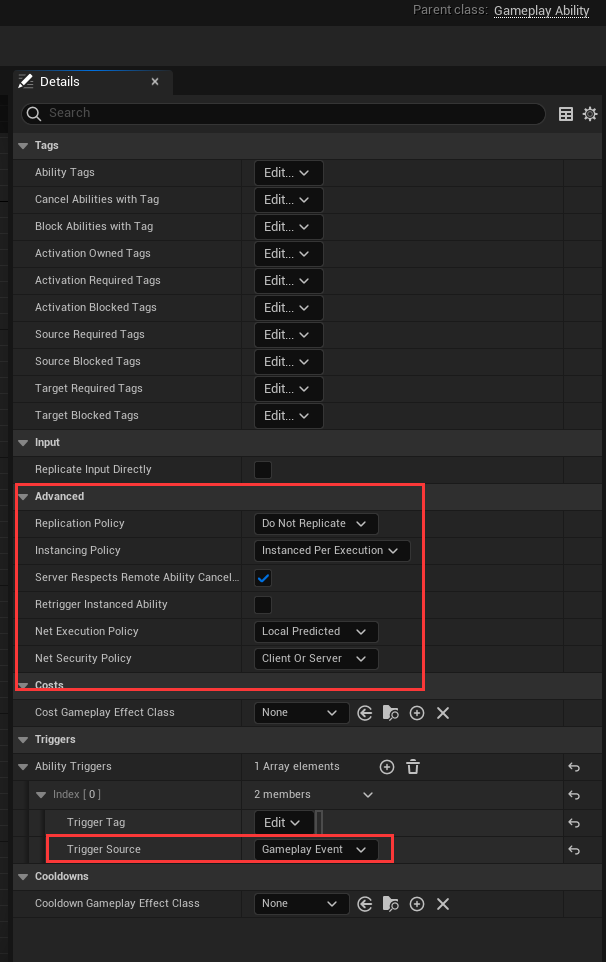
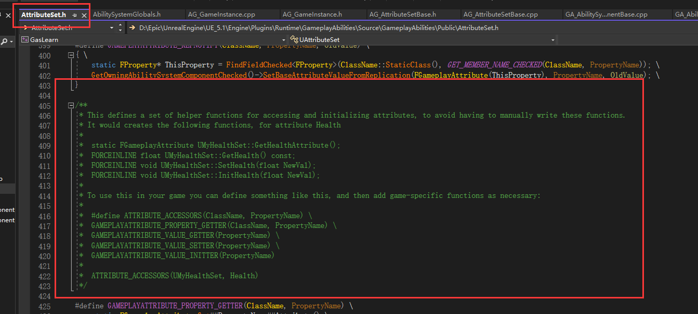

# Learn_GAS


## GAS 介绍

GAS 的优缺点

| 优点 | 缺点 |
| --- | --- |
| 灵活易扩展, 可实现复杂的技能流程 | 大量的概念和类, 学习曲线陡峭 |
| 支持联机复制和预测回滚 | 重度C++, BP不友好 |
| 易于团队协作和项目复用 | 需要按照框架定义一堆才能开始启动 |
| 细粒度思考实现单个动作逻辑 | GAS的网络服务必须配合DS |
| 数据驱动数值配置 | 实践演化框架, 可选插件, 文档不足 |
| 已经帮你处理复杂流程麻烦逻辑 | 要求技术功底高, 源码Debug能力强 |
| 适用于: 人多-大项目-多技能-联机-技术强-重表现 | 不适用于: 人少-小项目-少技能-单机-技术弱-弱表现 |

如何自己实现一个易于扩展的技能系统? 

- 逻辑部分:
  - 技能的获得和释放
  - 触发判断的条件
  - Buff系统
- 试听部分:
  - 动作动画
  - 特效
  - 声效
- 数据部分:
  - 数值计算
  - 数据配置
- 考虑网络联机

设计模式的本质是: 找到变化, 封装变化

由于上述这些技能的需求, 从而促成了 GAS 的诞生

| GAS 类 | 简称 |
| --- | --- |
| UAbilitySystemComponent | ASC |
| UGameplayAbility | GA |
| UGameplayEffect | GE |
| UGameplayCueNotify | GC |
| FGameplayAttribute | Attribute |
| FGameplayTag | Tag |
| UGameplayTask | Task |
| FGameplayEventData | Event |

- 谁可以释放技能？ 持有 ASC 组件的 Actor
- 如何编写技能逻辑？ 继承 GameAbility 
- 如何技能效果？ 继承 GameEffect (属性修改、增减Buff, 并不是特效)
- 技能改变的什么属性？ 使用 GamePlayAttribute 属性系统
- 技能释放的条件？ 使用 GameplayTag 进行条件判断
- 技能的视角表现效果？ 使用 GameplayCue
- 技能的长时行动？ 使用 GameplayTask 
- 技能消息事件？ 使用 GameplayEvent

### GameplayTags

GameplayTags 游戏标签

- 是层次化的字符串标签 "A.B.C"
- 轻量级 `FName` , 可附加到各类上做搜索条件: `GameplayEffect`, `GameplayAbility`, `GameplayCue`, `GameplayEventData`
- 整体所有 `Tag` 构成一颗 `Tag` 树


可以在子标签上进行精确匹配, 也可以在父标签上进行总类筛选

子标签: `Ability.Melee.Close`; 父标签: `Ability.Melee`

比如当角色存在 `Ability.Melee.Close` 和 `Ability.Melee.Far` 等 Melee 下的 Tag 时技能不生效, 那么只用配置成 `Ability.Melee` 即可。 这就是父标签可以做的总类筛选


所有的 `GameplayTag` 都可以在 Project `Settings` 中找到

使用 GameplayTag 相比代码中写死 Bool、Enum 更加灵活


### GameplayEffect 

技能效果

- 决定一个技能的逻辑效果
- 可以配置: 类型、修改器、周期、应用需求、溢出处理、过期处理、显示处理、Tags条件、免疫、堆叠、能力赋予
- Effect 是修改 Attribute 的唯一通道


GE 一般通过 `UGameplayAbility` 的 Aplly 接口, 以 `UGameplayEffect` 为模板生成 `FGameplayEffectSpec` 实例化对象, `FGameplayEffectSpec` 对应一个 `FActiveGameplayEffect`, 然后通过组合到 `FActiveGamplayEffectsContainer` 容器中, 存储到 `UAbilitySystemComponent` 中

### GampelayCue 

技能特效

- 决定一个技能的视觉效果
- 可全局配置 `Tag-Handler` 的映射
- 可通过 `Effect` 触发, 也可以手动触发
- `Static`: 一次性的; `Actor`: 持久的创建在场景中
- 可重载: `OnActive` 、 `WhileActive` 、 `Executed` 、 `Removed` 来触发粒子特效或者音效等


如上图可见, GC 一般通过 `GA` 指定 `Executed/Add` 或者 GE 配置 `Cues` 来触发;触发后生成的实例存储在 FGameplayCueObjectLibrary 里的对象库中, 以提供后续的复用, 介绍触发时的延迟

GC 的触发分为两种情况: `Static` 和 `Actor`。`Static Cue` 直接在 `CDO` 上调用, 这意味着不要在 GC 中存储一些状态信息, 因为它不会生成新的对象; `Actor Cue` 触发 `Spawn` 生成新的实例, 这些生效的 GC 最终也是在 ASC 里引用保存

### GameAbility

游戏能力(技能)

- 能力是很广义的抽象 比如被打就是一种能力 没有被打的能力就不会被被打
- 不要把基础移动, 射线检测, UI交互当作能力
- 在不同的 Actor 上学习、取消、释放不同能力构成了主题逻辑
- 主要逻辑都写在 GA 里面
- 可重载: ActivateAbility, CommitAbility, CancelAbility, EndAbility


GA 一般是在外部被 `Owner Actor` 触发, 通过调用 `TryActivateAbility`

如果 GA 自身不需要保存状态, 则可以选择在 CDO 上直接调用; 如果需要每次实例化都跟踪不同的状态, 也可以选择每次生成新的实例

GA 实例化之后就是 `FGameplayAbilitySpec` , 可以通过配置 `Level` 去传递给 GA 触发的 GE, 从而触发不同等级的效果

这些激活的 GA 最后都会保存在 ASC 中

### GameplayTask

游戏异步任务

> 比如: 等待 `montage` 的播放完毕、 等待 AI 移动到指定位置

- 执行异步任务的框架
- 可被单独使用-> Task 是 UE 的基础模块, 可以独立与 GAS 之外运行
- 可用于异步长时间动画动作的触发和等待
- 已经预先实现好一系列 Tasks
- 可重载: `Activate、` `TickTask`


`Abilities` 插件引用 Task 模块的时候其实也是从 `GameplayTask` 里继承下来自定义子类, 这个子类多了一个 GA 的引用

这些 Task 也都是在 ASC 中执行, 所以 ASC 也是继承于 `UGameplayTasksComponent` 的

### 游戏事件


GAS 提供手动触发游戏事件

- 事件靠 Tag 识别, 可写代 Payload 数据
- 可触发技能
- 在另一端可等待具体 Tag 事件触发


GA 在 Wait GameplayEvent 的时候会在 ASC 内部记录一个回调, 通过 Tag 来映射识别; 而当外部别的 GA 调用 Send GameplayEvent 的时候, 会用 Event 的 Tag 在 ASC 的映射表中搜索, 如果搜索到就会触发对应的回调

### AbilitySystemComponent

游戏技能组件

- ASC 负责管理协调其他部分: Ability、 Effect、 Attribute、 Task、 Event...
- ASC 是技能系统运行的核心
- 拥有 ASC 的 Actor 才拥有释放技能的能力
- ASC 放在 Pawn 还是 PlayerState 上, 这是一个问题

如果是联机游戏, 推荐放在 PlayerState 上, 因为可以同步给客户端; Pawn 则有可能死亡, 重生后丢失状态

比如: dota 的英雄死亡会被Destroy掉, 如果 ASC 在 Pawn 上那么所有的数据也就丢失了, 此时角色重生之后技能的 CD 信息也就没有了


从上图的继承关系可以发现, ASC 继承自 `UGameplayTasksComponent`, 所以它具有执行 Task 的能力; 同时实现了多个接口

ASC 可以挂在在 `Owner Actor` 上, 初始化的时候会寻找 `OwnerActor` 上的 `AttributeSet` 进行注册

ASC 是运行的核心, 很多函数其实都是通过 ASC 转发

技能互相作用: 其实就是一个 Actor 上的 ASC 作用到另一个 Actor 上的 ASC

### 总结


## 简单使用

[GAS插件介绍（入门篇）](https://www.bilibili.com/video/BV1X5411V7jh/)

全称 `Gameplay Ability System` 简称 `GAS`， 是一个健壮的，高度可扩展的 `gameplay` 框架，通常用于构建 RPG、Moba 等游戏的完整战斗逻辑框架

通过 `GAS` ，可以快速地制作游戏中的 **主动**/**被动**技能、各种**效果buff**、**计算属性伤害**、**处理玩家各种战斗状态逻辑**

完整的技能框架需要: 可配置, 可编辑, 完整的制作流程, 联网…

`GAS` 提供的功能

- 实现了带有消耗和冷却功能的角色**技能**
- 处理**数值属性**(声明、魔法、攻击力、防御力)
- 应用**状态效果**(击飞、着火、眩晕)
- 应用**游戏标签**(GameplayTags)
- 生成**特效**和**音效**
- 完整的**网络复制**、**预测**功能

> 其他UE插件: **Able Ability System** 和 **Ascent Comba Framework**

### Ability System Component

`Ability System Component`(ASC) 是整个 GAS 的基础组件

ASC 本质上是一个 `UActorComponent`, 用于处理整个框架下的交互逻辑，包括使用**技能**(`GameplayAbility`)、 包含**属性**(`AttributeSet`)、处理各种**效果**(`GameplayEffect`)

所有需要应用 GAS 的对象 (Actor) 都必须拥有 GAS 组件

拥有 ASC 的 Actor 被称为 ASC 的 `OwnerActor`, ASC 实际作用的 Actor 叫做 `AvatarACtor`

ASC 可以被赋予某个角色 ASC, 可以被赋予 PlayerState (可以保存死亡角色的一些数据)

> 比如 Dota 角色死亡之后, 下次复活的时候大招CD仍然需要记录, 不能说死了一次大招CD没了

> 一些Demo项目 ASC 作用的永远都是 Character, 这样避免绕来绕去, 方便学习

### Gameplay Tags

`FGameplayTags` 是一种 层级标签, 比如 `Parent.Child.GrandChild`。通过 `GameplayTagManager` 进行注册

替代了原来的 `Bool` 或者 `Enum` 的结构, 可以在玩法设计上更高效的标记对象的行为或状态


以前的常用方法是使用 枚举 和 Bool值 进行状态标记。每次开发的时候要先判断这状态属于哪一类等

Tags 是一种定义层级标签的方式, 有父子级关系。 所有 Tags 支持根据不同的状态、情况进行一个归类


> 父级 **受限** 表命状态, 子集 **减速**、**击飞**、**眩晕** 表示具体的状态
> 比如一些技能可以移除 **受限** 状态, 那么只需要对父级标签 **受限** 进行处理, 其所有子集都会被影响

### Gameplay Ability

`Gameplay Ability` (GA) 标识了游戏中一个对象(Actor)可以做的**行为**或**技能**

能力(`Ability`) 可以是普通攻或者吟唱攻击, 可以是角色被击飞倒地, 还可以是使用某种道具, 交互某个物件, 甚至跳跃、飞行等角色行为也可以是 `Ablity`

`Ability` 可以被赋予对象或从对象的 `ASC` 中移除, 对象同时可以激活多个 `GameplayAbility`

> 基本的移动输入、UI交互行为则不能或不建议通过 GA 来实现


上面就是一个 `GA` 的简单案例, 从 `Event ActivateAbility` 事件开始, `Montage` 播放结束时触发 `End Ability` , `montage` 播放是根据 `notify` 动画通知 添加 GE

右侧是这个 GA 的标签, 和这个 GA 会影响的其他系统的标签


上面就是 GA 的一个简单调用流程

1. `TryActivateAbility` 尝试使用技能 开始进入 GA 释放流程
2. `CanActivateAbility` 判断能否使用技能
3. `ActivateAbility` 如果技能可以释放则触发该事件 进入 GA 内部的流程
4. 技能前摇
5. `CommitAbility` 确认技能释放, 开始消耗蓝条、进入CD等 (比如一些技能有释放前摇, 在完全释放出去之前都不进入CD)
   - `CommitAbility` 有三种: `CommitAbility、` `CommitAbilityCooldown、CommitAbilityCost`, 分别表示 同时消耗蓝和进入CD、只消耗蓝、只进入CD
   - 区分三种是因为可能存在这么一种技能: 释放时立刻消耗蓝, 在完成吟唱之后再进入CD
   - `CommitAbility` 本质上就是执行 AE, 所以手动执行对应的 AE 也可以完成功能
6. 技能释放中的一些操作
7. 技能后摇
8. `EndAbility` 当技能后摇的某个时间点被认定为技能结束时调用接口

### Gameplay Effect

`Gameplay Effect` 是 `Ability` 对自己或他人**产生影响**的途径

GE 通常可以被理解为游戏中的 `buff` (比如增益/减少效果、修改属性)

但是 GAS 中的 GE 更加广义, 释放技能时候的**伤害结算**, 施加特殊效果的**控制**、**霸体**效果 (修改 `GameplayTag`) 都是通过 GE 来实现的

> 当目标有 **霸体** 的 Tag 时, 移除负面 Tag 的 GE。通过这样可以实现目标效果

GE 相当于一个可配置的**数据表**, 不可以添加逻辑。 开发者创建一个 `UGameplayEffect` 的派生蓝图, 就可以根据需求制作想要的效果


> 得自己尝试各个参数的意义… 翻译不一定正确 用了才知道


当你的 GE 是持续一段时间 或者 无限时间的时候, `Period` 就表示周期性激活

- `Period` 表示时间间隔, 也就是 `interval`
- `Execute Periodic Effect on Application` 表示是否是一激活就执行
  - 先以 TS 的 `interval` 举例, TS 的 `interval` 在第0秒的时候并不会执行函数体, 而是第一个周期到了之后才会执行
  - 类似的, 这里表示 GE 激活的时候立刻执行扣血逻辑, 还是等待 interval 第一个周期到了再执行扣血逻辑


GE 中的 Stacking 表示层, 比如: Dota 中蝙蝠可以给对方叠5层油。也就是一个 buff 可以叠加多层


GE 也可以赋予能力

### Attribute Set

`AttributeSet` 负责定义和持有属性, 并且管理属性的变化, 包括网络同步

什么是属性: 生命值、魔法值、攻击力、防御力等

需要在 Actor 中添加为成员变量, 并注册到 ASC (C++)

一个 ASC 可以拥有一个或多个(不同)的 `AttributeSet`, 因此可以角色共享一个很大的 `AttributeSet，` 也可以每个角色按需添加 `AttributeSet`

可以在属性变化前(`PreAttributeChange`) 后(`PoasGameplayEffectExecute`) 处理相关逻辑, 可以通过委托的方式绑定属性变化


上图中的代码定义了一个名为 `Damage` 的属性,

`ATTRIBUTE_ACCESSORS(UFightAttributeSet, Damage)` 是一个宏定义，它创建了用于访问属性的一些便捷函数。这些函数包括获取属性的当前值、设置属性的当前值以及获取属性的最大值等

`OnRep_Damage` 是一个函数声明，它是属性 `Damage` 的变动时触发的属性修改通知函数。当 `Damage` 属性发生变化时，该函数会被调用。在该函数中，可以编写处理 `Damage` 变动的逻辑

上图下面的重写函数是 GAS 提供的回调函数, 用于属性或效果执行过程中进行自定义逻辑的处理

- `PreGameplayEffectExecute`: 在应用 `GameplayEffect` 之前被调用，允许自定义逻辑并决定是否执行效果。当返回值为 false 时，将取消效果的执行
- `PostGameplayEffectExecute`: 在应用 `GameplayEffect` 之后被调用，允许自定义逻辑处理效果的执行结果
- `PreAttributeChange`: 在属性值变化之前被调用，允许自定义逻辑并修改属性的新值
- `PostAttributeChange`: 在属性值变化之后被调用，允许自定义逻辑处理属性值的变化结果，并提供旧值和新值的信息
- `PreAttributeBaseChange`: 在属性基础值变化之前被调用，允许自定义逻辑并修改属性的新基础值
- `PostAttributeBaseChange`: 在属性基础值变化之后被调用，允许自定义逻辑处理属性基础值的变化结果，并提供旧值和新值的信息
- `OnAttributeAggregatorCreated`: 在创建属性聚合器（Aggregator）时被调用，允许自定义逻辑处理属性聚合器的创建过程

那么什么时候需要拆分多个 `AttributeSet` 呢?

拿英雄联盟举例，有些英雄没有蓝、有些英雄靠怒气、有些英雄靠能量.... 如果将这些属性全部放在一个 `AttributeSet` 中就显得臃肿也不好管理, 于是将通用部分拆出来

### GAS的使用流程


点击攻击键攻击目标角色

1. 使用 `GA_Attack_Attr`


使用 `Montage` 播放动画, 当 `Anim Notify` 触发的时候做射箭检测

给被攻击到的 `Actor` 的 `ASC` 添加 `GE_Hit` 和 `GE_Damage` 标签

除了运行逻辑, 还需要关注右边的 `Class Defaults` 

在 `Tags` 分类中

- `Ability Tags` 表示这个能力的标签
- `Calcel Abilities With Tag` 表示当此 GA 被激活时, 停止属于这个 Tag 的其他 GA 的运行 
- `Block Abilityies With Tag` 表示与此 GA 被激活时, 阻止属于这个 Tag 的其他 GA 被激活
- `Activation Blocked Tags` 表示当 Actor 存在这个 Tag 的时候, 这个 GA 不能被激活

这里将 `Ability Tag` 和 `Block Abilities With Tag` 设置成相同的 Tag, 可以保证玩家重复点击攻击键的时候角色不会出现鬼畜的情况

因为第一次攻击会给 Player 添加`Ability.Positive` 标签, 第二个点击攻击键时如果第一次攻击没有结束, 那么对应的标签也不会被删除, 那么第二次攻击的 GA 就不会激活

在 `Costs` 分类中 

- `Cost Gameplay Effet Class` 就是这个技能被 `Commit` 的时候的消耗(扣血、扣蓝等)

这里, 当 `GA_Attack` 运行到 `CommitAbility` 的时候, 会激活 `GE_Cost`

2. 使用 `GE_Hit` 


- `Gameplay Effect` 中的 `Duration Policy`

该属性具有三种选项: `Instant`、`Infinite`、`HasDuration`, 分别表示 立即生效、永久存在、一定时间内存在

一般来说 `Instant` 就是单纯做伤害计算用的, 不会去做tag处理
一般来说 `Infinite` 做常驻技能, 比如被动 


这里给被打的对象添加了一个 `Ability.Hit` 的标签

这个GE会持续 0.1s 的时间, 是因为我们觉得角色被打的僵直动作有 0.1s 

3. 触发 `GA_BeAttack`


当被打的 `Actor` 添加了 `Ability.Hit` 标签, 那么这个 `GA_BeAttack` 就会被触发

被打的时候就播放一个 `Montage`,

这里被打也是一种能力(某些Boss就是没有被打的能力, 不会出现僵直)

注意这个 `GA_BeAttack` 的 `Triggers` 属性部分, 当 `Ability.Hit` 标签被添加的时候触发

这里 `Trigger Source` 有三种选项

- `Gameplay Event`: 使用 `SendGameplayEvent` 等节点调用, 触发指定 Tag 激活
- `Owned Tag Added`: 当指定 Tag 被添加到 Actor 上时被激活
- `Owned Tag Present`:  // TODO

4. 触发攻击消耗 `GE_Cost`, 配置在 `GA_Attack` 的 Cost 属性中


这里可以发现这个 GE 的 `Duration Policy` 是 `Instant` 的, 也就是立即执行的

它配置了一个 `Modifiers`, 这个 `Modifier` 的操作是对 `SampleAttributSet` 的 `Physical` 属性执行 `Add` 操作, 修改的数值是 `-5`, 说白了就是将角色的蓝量扣除5

5. 攻击触发扣血 `GE_Damage`


同理对角色的血量进行扣除

### FGameplayAttributeData

我们发现 `AttributeSet` 中属性的值并不是float、int等普通数据类型, 而是 `FGameplayAttributeData` 这种类型

```c++
USTRUCT(BlueprintType)
struct GAMEPLAYABILITIES_API FGameplayAttributeData
{
	GENERATED_BODY()
    // ...
	FGameplayAttributeData(float DefaultValue)
		: BaseValue(DefaultValue)
		, CurrentValue(DefaultValue)
	{}

    // ...
}
```

可以看到 `FGameplayAttributeData` 有俩个值: `BaseValue` 和 `CurrentValue`

这么定义的原因是方便数据回滚, 比如Player得到一个buff可以增加攻击力10% 持续5s, 通过区分`BaseValue` 和 `CurrentValue`可以方便计算移除buff后的数值

## 基于GAS的多人游戏编程

你的一款游戏中的角色可以做很多不同的事情: 跳跃、射击、短跑等, 在某些时候不得不执行定义关系的规则, 比如射击时不能冲刺等

对于新手来说 if-else 或许是一个常规选择, 并且对于自己写的框架往往会出现错误和设计问题, 需要花费时间进行处理

GAS 将每种能力识别为一个单独的对象, 他们的能力可以运行自己的逻辑; 不是试图创建严格的状态机, 而是通过轻量级游戏标签( `GameplayTags` )处理能力之间的关系

GAS 主要由: Ability、System、Component Ability、Gampelay Tasks、Gameplay Tags、Gameplay Attributes、Gameplay Effects、Gameplay Cues 和 GameplayEvents 组成

### 从 ASC 开始

#### 给予 GA

在激活一个能力之前, 需要先将其将给 Actor: `GiveAbility` 和 `GiveAbilityAndActivateOnce` 接口

```cpp
FGameplayAbilitySpecHandle UAbilitySystemComponent::GiveAbility(const FGameplayAbilitySpec& Spec)
{
  // 有效性判断.... 代码已经跳过

  // 如果是客户端模拟的Actor则不允许客户端提供能力, 而是服务器提供
  if (!IsOwnerActorAuthoritative())
  {
    ABILITY_LOG(Error, TEXT("GiveAbility called on ability %s on the client, not allowed!"), *Spec.Ability->GetName());

    return FGameplayAbilitySpecHandle();
  }

  // 因为 GAS 支持多线程, 所以这里使用了范围锁
  // 如果ASC被锁定，也就是正在处理技能相关的逻辑，那么将Spec添加到待处理列表中，返回它的句柄
  if (AbilityScopeLockCount > 0)
  {
    AbilityPendingAdds.Add(Spec);
    return Spec.Handle;
  }

  ABILITYLIST_SCOPE_LOCK();

  // 在这里, 将能力添加到 ASC 的激活能力的容器中 
  FGameplayAbilitySpec& OwnedSpec = ActivatableAbilities.Items[ActivatableAbilities.Items.Add(Spec)];

  // 根据 GA 的设置判断此时是否需要实例化
  if (OwnedSpec.Ability->GetInstancingPolicy() == EGameplayAbilityInstancingPolicy::InstancedPerActor)
  {
    // 创建实例化的 GA
    CreateNewInstanceOfAbility(OwnedSpec, Spec.Ability);
  }

  OnGiveAbility(OwnedSpec);
  MarkAbilitySpecDirty(OwnedSpec, true);

  return OwnedSpec.Handle;
}
```

`GiveAbility` 函数返回的 `Handle` 是一个 `FGameplayAbilitySpecHandle` 类型的对象，它是一个用于标识 `Spec` 的结构体，包含了一个 `GUID` （全局唯一标识符）和一个版本号。通过这个 `Handle` ，可以在 `ASC` 中找到对应的 `Spec` ，或者在网络中同步 `Spec` 的数据。

通过 `Handle` ，可以做以下一些事情：

- 调用ASC的 `FindAbilitySpecFromHandle` 函数，根据 `Handle` 查找对应的 `Spec`
- 调用ASC的 `ClearAbility` 函数，根据Handle移除对应的 `Spec`
- 调用ASC的 `SetRemoveAbilityOnEndAbility` 函数，根据Handle设置对应的 `Spec` 是否在技能结束时移除
- 调用ASC的 `TryActivateAbility` 函数，根据Handle尝试激活对应的 `Spec`
- 调用ASC的 `GetActivatableGameplayAbilityFromHandle `函数，根据 `Handle` 获取对应的Spec中的 `Ability` 实例
- 调用ASC的 `GetAbilityLevel` 函数，根据 `Handle` 获取对应的 `Spec` 中的技能等级
- 调用ASC的 `SetAbilityLevel` 函数，根据 `Handle` 设置对应的 `Spec` 中的技能等级
- 调用ASC的 `MarkAbilitySpecDirty` 函数，根据 `Handle` 标记对应的 `Spec` 为脏数据，并通知服务器或客户端

GA 有三种实例化方式: `NonInstanced`、`InstancedPerActor`、`InstancedPerExecution`, 对应的代码如下   

```cpp
enum Type
{
  // GA 不会被实例化. 每次都是执行该 GA 的 CDO.
  NonInstanced, 

  // 每个 Actor 都有一个实例化的 GA. State can be saved, replication is possible.
  InstancedPerActor,

  // 在每次执行的时候实例化 GA. Replication possible but not recommended.
  InstancedPerExecution,
};
```

针对存储 GA 的容器

```cpp
UPROPERTY(ReplicatedUsing=OnRep_ActivateAbilities, BlueprintReadOnly, Category = "Abilities")
FGameplayAbilitySpecContainer ActivatableAbilities;

USTRUCT(BlueprintType)
struct GAMEPLAYABILITIES_API FGameplayAbilitySpecContainer : public FFastArraySerializer
{
  // ...省略部分

  /** List of activatable abilities */
  UPROPERTY()
  TArray<FGameplayAbilitySpec> Items;

  /** Component that owns this list */
  UPROPERTY(NotReplicated)
  TObjectPtr<UAbilitySystemComponent> Owner;

  /** Initializes Owner variable */
  void RegisterWithOwner(UAbilitySystemComponent* Owner);

  // 支持复制, 并且默认情况下可以根据设置复制规范
  bool NetDeltaSerialize(FNetDeltaSerializeInfo & DeltaParms)
  {
    return FFastArraySerializer::FastArrayDeltaSerialize<FGameplayAbilitySpec, FGameplayAbilitySpecContainer>(Items, DeltaParms, *this);
  }

  template< typename Type, typename SerializerType >
  bool ShouldWriteFastArrayItem(const Type& Item, const bool bIsWritingOnClient)
  {
    // 如果不希望 Ability Spec 被复制, 可以返回False
    if (!Item.ShouldReplicateAbilitySpec())
    {
      return false;
    }

    if (bIsWritingOnClient)
    {
      return Item.ReplicationID != INDEX_NONE;
    }

    return true;
  }
};
```

`CreateNewInstanceOfAbility` 是如何创建实例并添加到容器中的

```cpp
UGameplayAbility* UAbilitySystemComponent::CreateNewInstanceOfAbility(FGameplayAbilitySpec& Spec, const UGameplayAbility* Ability)
{
  // 省略检查

  AActor* Owner = GetOwner();

  // 在拥有者的内存空间中，根据Ability的类类型，创建一个新的Ability对象，检查是否成功
  UGameplayAbility * AbilityInstance = NewObject<UGameplayAbility>(Owner, Ability->GetClass());

  // 根据Ability的复制策略，将新创建的Ability实例添加到Spec的复制实例列表或非复制实例列表中，以防止它被垃圾回收
  if (AbilityInstance->GetReplicationPolicy() != EGameplayAbilityReplicationPolicy::ReplicateNo)
  {
    // 如果Ability需要复制，还要调用AddReplicatedInstancedAbility函数，将它添加到ASC的复制实例列表中，并通知服务器
    Spec.ReplicatedInstances.Add(AbilityInstance);
    AddReplicatedInstancedAbility(AbilityInstance);
  }
  else
  {
    Spec.NonReplicatedInstances.Add(AbilityInstance);
  }

  return AbilityInstance;
}
```

#### 激活 GE

可以通过 `ApplyGameplayEffectSpecToSelf` 函数来应用 GE

该函数做了很多事情

1. 如果 GE 是持续性的效果, 那么会先在 ASC 中查找是否已经存在一个相同的效果, 如果存在相同的效果, 那么会合并两个效果, 也就是重置已有效果的开始时间, 并返回已有效果的句柄
2. 如果 GE 不是持续性效果, 或者没有找到相同的效果, 那么会创建一个新的 GE 对象, 并用 Spec 和 预测键 来初始化 
  - 预测键: 用于网络同步和预测的一个结构体, 可以标识效果是由谁发起的, 以及是否需要确认或拒绝
  - 然后会通过 `UAbilitySystemGlobals::Get().GlobalPreGameplayEffectSpecApply` 来在全局范围内触发一个事件, 通知其他系统有一个新的 Spec 要被应用
  - 然后调用 `OurCopyOfSpec->CaptureAttributeDataFromTarget(this)` 将目标的 `AttributeData` 保存在 GE 中
3. 然后会判断是否需要将 Spec 视为无限持续的效果, 如果是那么会在 Spec 中添加一个修改器( `Modifier` ) 将持续时间设置为无限
     - `bool bTreatAsInfiniteDuration = GetOwnerRole() != ROLE_Authority && PredictionKey.IsLocalClientKey() && Spec.Def->DurationPolicy == EGameplayEffectDurationType::Instant;` 通过这段代码去判断是否需要设置为无限
     - 首先，它会获取ASC的拥有者角色，也就是拥有技能的Actor的角色，比如服务器、客户端、模拟代理等。如果拥有者角色不是服务器，也就是不是网络权威端，那么继续判断下一个条件
     - 然后，它会获取传入的预测键，也就是用于网络同步和预测的一个结构体，它可以标识效果是由谁发起的，以及是否需要确认或拒绝。如果预测键是一个本地客户端键，也就是由本地客户端发起的效果，并且没有被服务器确认或拒绝，那么继续判断下一个条件
     - 最后，它会获取Spec的持续策略，也就是效果是瞬时的、无限的还是有限的。如果持续策略是瞬时的，也就是效果只会执行一次并立即结束，那么满足所有条件
     - 如果满足所有条件，那么将 `bTreatAsInfiniteDuration` 设为 true ，表示需要将 `Spec` 视为无限持续的效果。这样做的目的是为了在预测模式下保证效果能够正确地执行和复制
4. 然后判断是否需要触发 GC 事件, 也就是一些外部提示效果, 比如: 粒子特效、声音等。如果需要, 并且激活效果对象存在并且没有被抑制, 并且没有找到相同的可堆叠效果或者Spec不一致堆叠提示效果, 那么它会调用 `InvokeGameplayCueEvent` 或者 `UAbilitySystemGlobals::Get().GetGameplayCueManager()->InvokeGameplayCueAddedAndWhileActive_FromSpec` 函数，在本地或者远程触发 `GameplayCue` 事件
5. 如果无限持续的效果(非权威、是由预测而来) 那么就只通过 `UAbilitySystemGlobals::InvokeGameplayCueExecuted_FromSpec` 添加 GC 
6. 如果是瞬时执行的(是权威), 那么就执行 GE 的效果 `ExecuteGameplayEffect` 
7. 然后通过 `ActiveGameplayEffects.AttemptRemoveActiveEffectsOnEffectApplication` 来检查是否有一些已存在的 GE 需要被移除, 比如因为互斥或者替换等原因
8. 然后遍历 `Spec` 的目标效果列表, 并递归的调用 `ApplyGameplayEffectSpecToSelf` 将这些 GE 也应用到自身

**在 `bTreatAsInfiniteDuration` 值的赋值过程中, 为什么 GE 的 `DurationPolicy` 是 `EGameplayEffectDurationType::Instant` 瞬时的, 确要将 `bTreatAsInfiniteDuration` 设置为 true?**

这是为了解决一个网络同步和预测的问题。在网络游戏中，客户端和服务器之间会有一定的延迟，导致客户端看到的效果和服务器看到的效果可能不一致。为了提高游戏体验，客户端会在没有收到服务器的确认或拒绝之前，先预测效果的结果，并显示给玩家。这样可以减少玩家感觉到的延迟，但也可能导致预测错误，比如效果被服务器拒绝或者修改

对于瞬时的效果，如果客户端预测它已经执行并结束了，那么它就不会再将它复制给服务器或者其他客户端，也不会再处理服务器或者其他客户端发来的关于这个效果的消息。这样就可能导致效果在不同的角色之间不一致，比如客户端看到自己造成了伤害，但是服务器和其他客户端看到目标没有受伤

为了避免这种情况，客户端在预测模式下会将瞬时的效果视为无限持续的效果，也就是将它添加到ASC中，并等待服务器或者其他客户端的确认或拒绝。这样可以保证效果能够正确地执行和复制，以及及时地处理网络消息。当然，这样做也会占用一些内存空间，所以只有在必要的时候才会这样做

**Unreal 引擎中 Actor 在网络游戏中的有哪些不同角色**

```cpp
UENUM()
enum ENetRole
{
	/** No role at all. */
	ROLE_None,
	/** Locally simulated proxy of this actor. */
	ROLE_SimulatedProxy,
	/** Locally autonomous proxy of this actor. */
	ROLE_AutonomousProxy,
	/** Authoritative control over the actor. */
	ROLE_Authority,
	ROLE_MAX,
};
```

- `ROLE_None`: 没有任何角色，也就是不参与网络同步和预测，一般用于单机游戏或者不需要网络的Actor
- `ROLE_SimulatedProxy`: 模拟代理，也就是由服务器控制的Actor的客户端副本，它会接收服务器发来的状态更新，并模拟Actor的行为，但不能自主地改变Actor的状态
- `ROLE_AutonomousProxy`: 自主代理，也就是由客户端控制的Actor的客户端副本，它可以自主地改变Actor的状态，并将其复制给服务器和其他客户端，但也需要接收服务器或者其他客户端发来的状态更新，并处理可能的预测错误
- `ROLE_Authority`: 权威，也就是由服务器控制的Actor的服务器副本，它可以自主地改变Actor的状态，并将其复制给所有客户端，它是网络游戏中Actor状态的最终裁决者

**`InvokeGameplayCueAddedAndWhileActive_FromSpec` 和 `InvokeGameplayCueExecuted_FromSpec` 的区别**

`InvokeGameplayCueAddedAndWhileActive_FromSpec` 是用于触发 OnActive 和 WhileActive 两种类型的GameplayCue事件，也就是表示效果已经开始并且持续生效的提示效果，比如一个光环或者一个持续伤害
`InvokeGameplayCueExecuted_FromSpec` 是用于触发 Executed 类型的 GameplayCue 事件，也就是表示效果已经执行并且结束的提示效果，比如一个爆炸或者一个治疗

### GA

一个 GA 处理能力的方式由一组策略定义



```cpp
UENUM(BlueprintType)
namespace EGameplayAbilityInstancingPolicy
{
  /**  
    定义了技能在执行时是如何实例化的，也就是是否会创建一个技能对象来保存状态和逻辑
    这会影响技能的复制和预测，以及技能可以做的事情
  */
  enum Type
  {
    // 技能不会被实例化，任何执行技能的地方都是操作在技能的类默认对象（CDO）上，也就是一个模板对象
    // 这种技能不能有状态，也不能复制或预测，只能用于一些简单的逻辑，比如修改属性或者触发事件
    NonInstanced,

    // 每个拥有技能的Actor都会有自己的技能实例，也就是一个技能对象
    // 这种技能可以有状态，也可以复制或预测，可以用于一些复杂的逻辑，比如持续效果或者延迟操作。
    InstancedPerActor,

    // 每次执行技能都会创建一个新的技能实例，也就是一个技能对象
    // 这种技能可以有状态，也可以复制或预测，但不推荐使用，因为会占用很多内存空间
    // 可以用于一些特殊的逻辑，比如多段攻击或者分裂效果
    InstancedPerExecution,
    };
  }
```

```cpp
UENUM(BlueprintType)
namespace EGameplayAbilityNetExecutionPolicy
{
  /** 定义了技能在网络中是如何执行的，也就是客户端是如何请求和处理服务器的响应的
  这会影响网络同步和预测的效果和性能 */
  enum Type
  {
    // 客户端在请求服务器执行技能之前，先预测技能的结果，并显示给玩家
    // 当收到服务器的响应时，如果和预测一致，则保持不变；如果和预测不一致，则修正为服务器的结果
    // 这种策略可以减少玩家感觉到的延迟，但也可能导致预测错误和修正抖动
    LocalPredicted		UMETA(DisplayName = "Local Predicted"),

    // 客户端不请求服务器执行技能，而是直接执行并显示给玩家。服务器也不会执行或复制这个技能
    // 这种策略只适用于一些不影响游戏逻辑和状态的技能，比如一些纯粹的视觉或声音效果
    LocalOnly			UMETA(DisplayName = "Local Only"),

    // 服务器主动执行并复制这个技能给客户端
    // 客户端不能请求执行这个技能，只能接收服务器发来的结果，并显示给玩家
    // 这种策略适用于一些由服务器控制的技能，比如AI角色或者环境物体的技能
    ServerInitiated		UMETA(DisplayName = "Server Initiated"),

    // 服务器只在自己执行这个技能，并不复制给客户端
    // 客户端不能请求或接收这个技能的结果
    // 这种策略适用于一些只在服务器上运行的技能，比如一些后台计算或者统计功能。
    ServerOnly			UMETA(DisplayName = "Server Only"),
  };
}
```

```cpp
UENUM(BlueprintType)
namespace EGameplayAbilityNetSecurityPolicy
{
  /** 定义了技能在网络中有什么样的保护措施，也就是客户端是否可以请求改变或终止这个技能的执行
  这会影响网络安全和可靠性 */
  enum Type
  {
    // 没有任何保护措施。客户端或者服务器都可以自由地请求执行、取消或结束这个技能
    // 这种策略需要信任客户端，并且假设没有作弊或者恶意行为
    ClientOrServer			UMETA(DisplayName = "Client Or Server"),

    // 客户端请求执行这个技能会被服务器忽略。客户端只能请求取消或结束这个技能
    // 这种策略适用于一些由服务器控制执行时机的技能，比如一些定时触发或者条件触发的技能
    ServerOnlyExecution		UMETA(DisplayName = "Server Only Execution"),

    // 客户端请求取消或结束这个技能会被服务器忽略。客户端只能请求执行这个技能
    // 这种策略适用于一些由服务器控制结束时机的技能，比如一些持续效果或者延迟操作的技能。
    ServerOnlyTermination	UMETA(DisplayName = "Server Only Termination"),

    // 服务器控制这个技能的执行和终止。客户端任何请求都会被服务器忽略
    // 这种策略适用于一些完全由服务器控制的技能，比如一些核心逻辑或者敏感数据的技能
    ServerOnly				UMETA(DisplayName = "Server Only"),
  };
}
```

```cpp
UENUM(BlueprintType)
namespace EGameplayAbilityReplicationPolicy
{
  /** 定义了技能在网络中是如何复制状态和事件的，也就是是否会创建一个技能对象来保存状态和逻辑，并将它复制给其他角色
  这会影响网络同步和预测，以及技能可以做的事情 */
  enum Type
  {
    // 不复制这个技能的实例给任何人
    // 这种策略适用于一些不需要网络同步和预测的技能，比如一些纯粹的视觉或声音效果
    ReplicateNo			UMETA(DisplayName = "Do Not Replicate"),

    // 复制这个技能的实例给拥有者
    // 这种策略适用于一些需要网络同步和预测的技能，比如一些有状态或者复杂逻辑的技能
    ReplicateYes		UMETA(DisplayName = "Replicate"),
  };
}
```

```cpp
UENUM(BlueprintType)
namespace EGameplayAbilityTriggerSource
{
  /**	定义了什么样的触发器会激活这个技能，以及触发器和一个标签的关系。这会影响技能的激活方式和条件 */
  enum Type
  {
    // 由一个游戏事件触发，也就是一个带有有效载荷（Payload）的消息，比如伤害、死亡、碰撞等
    // 触发器需要匹配事件中的标签，才能激活技能。
    GameplayEvent,

    // 由拥有者获得一个标签触发，也就是拥有者的标签容器中添加了一个新的标签
    // 触发器需要匹配添加的标签，才能激活技能，并且只会在添加时触发一次
    OwnedTagAdded,

    // 由拥有者拥有一个标签触发，也就是拥有者的标签容器中已经存在了一个标签
    // 触发器需要匹配存在的标签，才能激活技能，并且只要标签存在就会持续激活
    OwnedTagPresent,
  };
}
```

GA 的触发可以有几种不同的方式开始, 通过 `GameplayTag` 或者 类 来调用 `UAbilitySystemComponent::TryActivateAbility` 方法来激活内部 GA

接下来是 `TryActivateAbility` 的执行顺序

`TryActivateAbility` 的**参数**是一个技能句柄，表示要激活的技能，以及一个布尔值，表示是否允许远程激活，也就是客户端向服务器请求激活。它的返回值是一个布尔值，表示是否成功激活了技能

1. 根据技能的 Handle 找到对应的 Spec, 也就是一个包含节能对象 和 一些属性的结构体
2. 获得 `UGameplayAbility` 和 `FGameplayAbilityActorInfo`对象
3. 获取目标 `Actor` 的网络模式（ `NetMode` ），也就是服务器、客户端或者模拟代理。如果是模拟代理，那么返回false，因为模拟代理不能主动激活技能
4. 如果不是本地控制并且允许远程激活, 那么向服务器发送一个客户端尝试激活技能的消息(`ClientTryActivateAbility`), 并返回true
5. 如果不是服务器，并且允许远程激活，那么先调用技能的 `CanActivateAbility` 函数，检查是否满足激活条件
     - 如果满足，那么向服务器发送一个服务器尝试激活技能的消息（`CallServerTryActivateAbility`），并返回true
     - 如果不满足，那么调用 `NotifyAbilityFailed函数` ，通知失败的原因，并返回false
     - 如果不允许远程激活，那么打印一个日志信息，并返回false
6. 调用 `InternalTryActivateAbility` 函数，在本地尝试激活技能，并返回结果
7. 最终会调用到 GA 的 `CallActivateAbility` 函数

**`!bIsLocal && (Ability->GetNetExecutionPolicy() == EGameplayAbilityNetExecutionPolicy::LocalOnly || Ability->GetNetExecutionPolicy() == EGameplayAbilityNetExecutionPolicy::LocalPredicted)` 出现的情况一般如下**: 

- 一个由服务器控制的AI角色想要使用一个LocalOnly或者LocalPredicted的技能，比如一个闪避或者冲刺的技能。这种情况下，服务器不能直接执行这个技能，而是需要向客户端发送一个请求，让客户端在本地执行这个技能，并显示给玩家
- 一个由其他客户端控制的Actor想要使用一个LocalOnly或者LocalPredicted的技能，比如一个隐身或者变形的技能。这种情况下，其他客户端不能直接执行这个技能，而是需要向服务器发送一个请求，让服务器转发给本地客户端，让本地客户端在本地执行这个技能，并显示给玩家

**`NetMode != ROLE_Authority && (Ability->GetNetExecutionPolicy() == EGameplayAbilityNetExecutionPolicy::ServerOnly || Ability->GetNetExecutionPolicy() == EGameplayAbilityNetExecutionPolicy::ServerInitiated)` 出现的情况一般如下**:

- 一个由本地客户端控制的Actor想要使用一个 `ServerOnly` 或者 `ServerInitiated` 的技能，比如一个召唤或者治疗的技能。这种情况下，本地客户端不能直接执行这个技能，而是需要向服务器发送一个请求，让服务器在服务器端执行这个技能，并复制给所有客户端
- 一个由模拟代理控制的Actor想要使用一个 `ServerOnly` 或者 `ServerInitiated` 的技能，比如一个爆炸或者击退的技能。这种情况下，模拟代理不能直接执行这个技能，而是需要等待服务器发来的指令，让服务器在服务器端执行这个技能，并复制给所有客户端

在 `GamepalyAbility` 中, 可以通过重写一些函数来处理 GA 执行流程

### GameplayTask

`GameplayTask` 是一个用于实现异步逻辑和效果的类，它可以在技能或者效果中使用，以便于实现一些延迟、循环、分支或者并行的操作

`GameplayTask` 可以通过 C++ 编写, 它的创建是通过静态函数从代码中进行的, 它可以从蓝图中给访问

[GameplayTask与GameplayTasksComponent协作流程分析](https://zhuanlan.zhihu.com/p/76925045)

### 定制 ASC 

记得在 `build.cs` 中引入 `GameplayAbilities` 和 `GameplayTasks` 模块

新建 `AG_AbilitySystemComponent` 类继承于 `AbilitySystemComponent`

新建 `AG_AttributeSetBase` 类继承于 `AttributeSetBase`

新建 `AG_GameInstance` 类继承于 `GameInstance` 用于初始化 `UAbilitySystemGlobals`



> 从 `AttributeSet.h` 文件中可以发现它提示了你一些写法

然后在 `Character` 的基类上添加一些方法用于初始化 GA、GE 和 ASC