# Learn_GAS

## 简介

[GAS插件介绍（入门篇）](https://www.bilibili.com/video/BV1X5411V7jh/)

全称 `Gameplay Ability System` 简称 `GAS`， 是一个健壮的，高度可扩展的 `gameplay` 框架，通常用于构建 RPG、Moba 等游戏的完整战斗逻辑框架

通过 `GAS` ，可以快速地制作游戏中的 **主动**/**被动**技能、各种**效果buff**、**计算属性伤害**、**处理玩家各种战斗状态逻辑**

完整的技能框架需要: 可配置, 可编辑, 完整的制作流程, 联网…

`GAS` 提供的功能

- 实现了带有消耗和冷却功能的角色**技能**
- 处理**数值属性**(声明、魔法、攻击力、防御力)
- 应用**状态效果**(击飞、着火、眩晕)
- 应用**游戏标签**(GameplayTags)
- 生成**特效**和**音效**
- 完整的**网络复制**、**预测**功能

> 其他UE插件: **Able Ability System** 和 **Ascent Comba Framework**

### Ability System Component

`Ability System Component`(ASC) 是整个 GAS 的基础组件

ASC 本质上是一个 `UActorComponent`, 用于处理整个框架下的交互逻辑，包括使用**技能**(`GameplayAbility`)、 包含**属性**(`AttributeSet`)、处理各种**效果**(`GameplayEffect`)

所有需要应用 GAS 的对象 (Actor) 都必须拥有 GAS 组件

拥有 ASC 的 Actor 被称为 ASC 的 `OwnerActor`, ASC 实际作用的 Actor 叫做 `AvatarACtor`

ASC 可以被赋予某个角色 ASC, 可以被赋予 PlayerState (可以保存死亡角色的一些数据)

> 比如 Dota 角色死亡之后, 下次复活的时候大招CD仍然需要记录, 不能说死了一次大招CD没了

> 一些Demo项目 ASC 作用的永远都是 Character, 这样避免绕来绕去, 方便学习

### Gameplay Tags

`FGameplayTags` 是一种 层级标签, 比如 `Parent.Child.GrandChild`。通过 `GameplayTagManager` 进行注册

替代了原来的 `Bool` 或者 `Enum` 的结构, 可以在玩法设计上更高效的标记对象的行为或状态

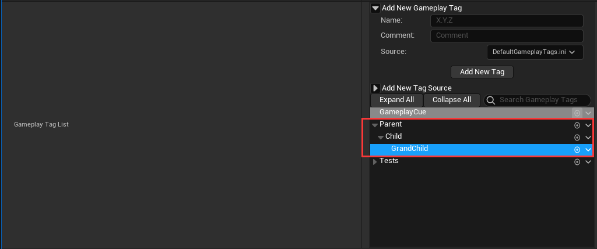

以前的常用方法是使用 枚举 和 Bool值 进行状态标记。每次开发的时候要先判断这状态属于哪一类等

Tags 是一种定义层级标签的方式, 有父子级关系。 所有 Tags 支持根据不同的状态、情况进行一个归类

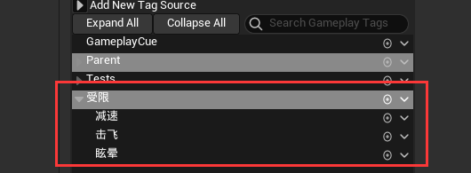

> 父级 **受限** 表命状态, 子集 **减速**、**击飞**、**眩晕** 表示具体的状态
> 比如一些技能可以移除 **受限** 状态, 那么只需要对父级标签 **受限** 进行处理, 其所有子集都会被影响

### Gameplay Ability

`Gameplay Ability` (GA) 标识了游戏中一个对象(Actor)可以做的**行为**或**技能**

能力(`Ability`) 可以是普通攻或者吟唱攻击, 可以是角色被击飞倒地, 还可以是使用某种道具, 交互某个物件, 甚至跳跃、飞行等角色行为也可以是 `Ablity`

`Ability` 可以被赋予对象或从对象的 `ASC` 中移除, 对象同时可以激活多个 `GameplayAbility`

> 基本的移动输入、UI交互行为则不能或不建议通过 GA 来实现

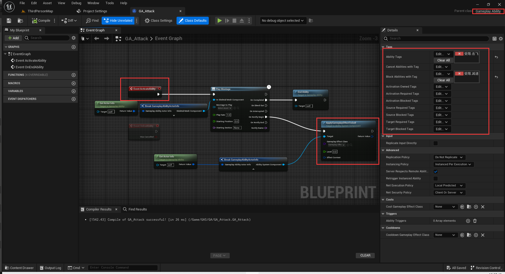

上面就是一个 `GA` 的简单案例, 从 `Event ActivateAbility` 事件开始, `Montage` 播放结束时触发 `End Ability` , `montage` 播放是根据 `notify` 动画通知 添加 GE

右侧是这个 GA 的标签, 和这个 GA 会影响的其他系统的标签

上面就是 GA 的一个简单调用流程

1. `TryActivateAbility` 尝试使用技能 开始进入 GA 释放流程
2. `CanActivateAbility` 判断能否使用技能
3. `ActivateAbility` 如果技能可以释放则触发该事件 进入 GA 内部的流程
4. 技能前摇
5. `CommitAbility` 确认技能释放, 开始消耗蓝条、进入CD等 (比如一些技能有释放前摇, 在完全释放出去之前都不进入CD)
   - `CommitAbility` 有三种: `CommitAbility、` `CommitAbilityCooldown、CommitAbilityCost`, 分别表示 同时消耗蓝和进入CD、只消耗蓝、只进入CD
   - 区分三种是因为可能存在这么一种技能: 释放时立刻消耗蓝, 在完成吟唱之后再进入CD
   - `CommitAbility` 本质上就是执行 AE, 所以手动执行对应的 AE 也可以完成功能
6. 技能释放中的一些操作
7. 技能后摇
8. `EndAbility` 当技能后摇的某个时间点被认定为技能结束时调用接口

### Gameplay Effect

`Gameplay Effect` 是 `Ability` 对自己或他人**产生影响**的途径

GE 通常可以被理解为游戏中的 `buff` (比如增益/减少效果、修改属性)

但是 GAS 中的 GE 更加广义, 释放技能时候的**伤害结算**, 施加特殊效果的**控制**、**霸体**效果 (修改 `GameplayTag`) 都是通过 GE 来实现的

> 当目标有 **霸体** 的 Tag 时, 移除负面 Tag 的 GE。通过这样可以实现目标效果

GE 相当于一个可配置的**数据表**, 不可以添加逻辑。 开发者创建一个 `UGameplayEffect` 的派生蓝图, 就可以根据需求制作想要的效果

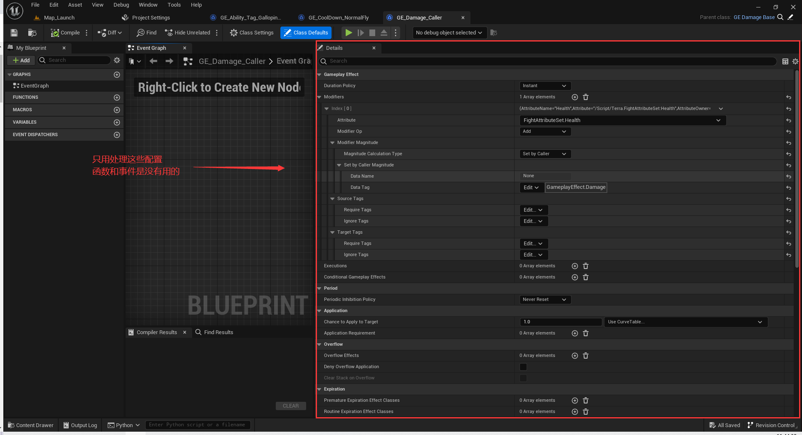

> 得自己尝试各个参数的意义… 翻译不一定正确 用了才知道

### Attribute Set

`AttributeSet` 负责定义和持有属性, 并且管理属性的变化, 包括网络同步

什么是属性: 生命值、魔法值、攻击力、防御力等

需要在 Actor 中添加为成员变量, 并注册到 ASC (C++)

一个 ASC 可以拥有一个或多个(不同)的 `AttributeSet`, 因此可以角色共享一个很大的 `AttributeSet，` 也可以每个角色按需添加 `AttributeSet`

可以在属性变化前(`PreAttributeChange`) 后(`PoasGameplayEffectExecute`) 处理相关逻辑, 可以通过委托的方式绑定属性变化

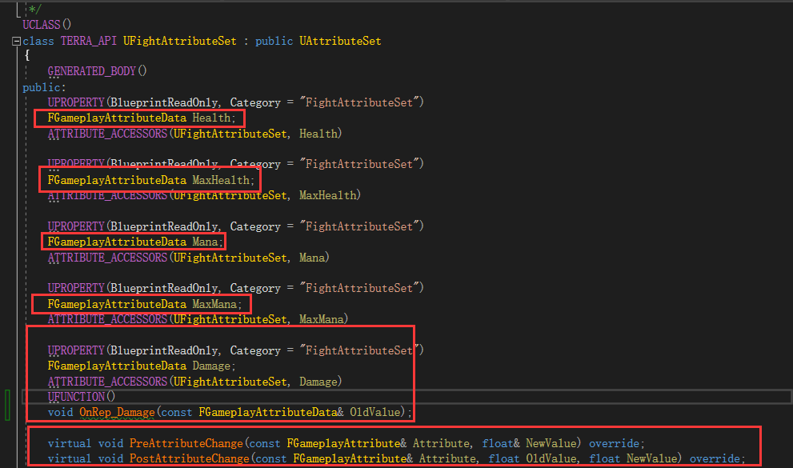

上图中的代码定义了一个名为 `Damage` 的属性,

`ATTRIBUTE_ACCESSORS(UFightAttributeSet, Damage)` 是一个宏定义，它创建了用于访问属性的一些便捷函数。这些函数包括获取属性的当前值、设置属性的当前值以及获取属性的最大值等

`OnRep_Damage` 是一个函数声明，它是属性 `Damage` 的变动时触发的属性修改通知函数。当 `Damage` 属性发生变化时，该函数会被调用。在该函数中，可以编写处理 `Damage` 变动的逻辑

上图下面的重写函数是 GAS 提供的回调函数, 用于属性或效果执行过程中进行自定义逻辑的处理

- `PreGameplayEffectExecute`: 在应用 `GameplayEffect` 之前被调用，允许自定义逻辑并决定是否执行效果。当返回值为 false 时，将取消效果的执行
- `PostGameplayEffectExecute`: 在应用 `GameplayEffect` 之后被调用，允许自定义逻辑处理效果的执行结果
- `PreAttributeChange`: 在属性值变化之前被调用，允许自定义逻辑并修改属性的新值
- `PostAttributeChange`: 在属性值变化之后被调用，允许自定义逻辑处理属性值的变化结果，并提供旧值和新值的信息
- `PreAttributeBaseChange`: 在属性基础值变化之前被调用，允许自定义逻辑并修改属性的新基础值
- `PostAttributeBaseChange`: 在属性基础值变化之后被调用，允许自定义逻辑处理属性基础值的变化结果，并提供旧值和新值的信息
- `OnAttributeAggregatorCreated`: 在创建属性聚合器（Aggregator）时被调用，允许自定义逻辑处理属性聚合器的创建过程

那么什么时候需要拆分多个 `AttributeSet` 呢?

拿英雄联盟举例，有些英雄没有蓝、有些英雄靠怒气、有些英雄靠能量.... 如果将这些属性全部放在一个 `AttributeSet` 中就显得臃肿也不好管理, 于是将通用部分拆出来

### GAS的使用流程

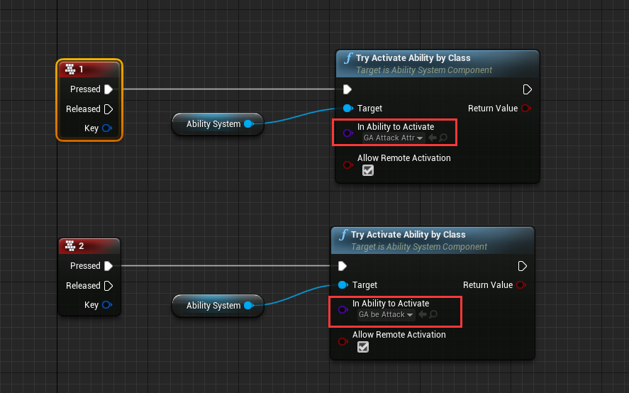

点击攻击键攻击目标角色

1. 使用 `GA_Attack_Attr`

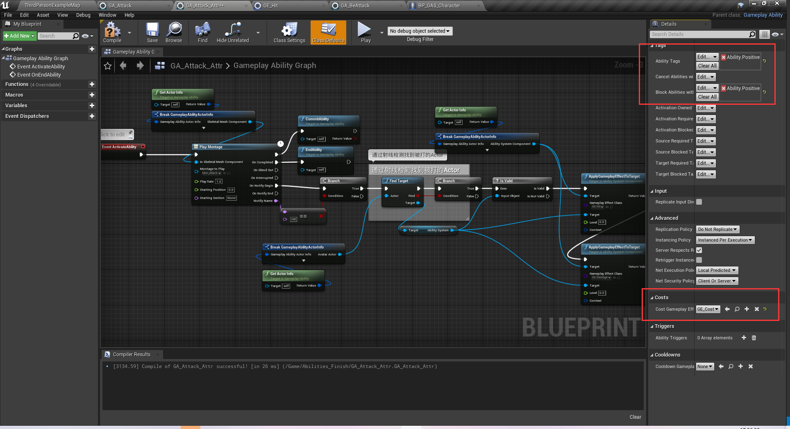

使用 `Montage` 播放动画, 当 `Anim Notify` 触发的时候做射箭检测

给被攻击到的 `Actor` 的 `ASC` 添加 `GE_Hit` 和 `GE_Damage` 标签

除了运行逻辑, 还需要关注右边的 `Class Defaults` 

在 `Tags` 分类中

- `Ability Tags` 表示这个能力的标签
- `Calcel Abilities With Tag` 表示当此 GA 被激活时, 停止属于这个 Tag 的其他 GA 的运行 
- `Block Abilityies With Tag` 表示与此 GA 被激活时, 阻止属于这个 Tag 的其他 GA 被激活
- `Activation Blocked Tags` 表示当 Actor 存在这个 Tag 的时候, 这个 GA 不能被激活

这里将 `Ability Tag` 和 `Block Abilities With Tag` 设置成相同的 Tag, 可以保证玩家重复点击攻击键的时候角色不会出现鬼畜的情况

因为第一次攻击会给 Player 添加`Ability.Positive` 标签, 第二个点击攻击键时如果第一次攻击没有结束, 那么对应的标签也不会被删除, 那么第二次攻击的 GA 就不会激活

在 `Costs` 分类中 

- `Cost Gameplay Effet Class` 就是这个技能被 `Commit` 的时候的消耗(扣血、扣蓝等)

这里, 当 `GA_Attack` 运行到 `CommitAbility` 的时候, 会激活 `GE_Cost`

2. 使用 `GE_Hit` 

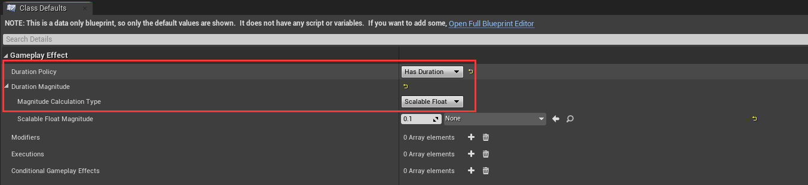

- `Gameplay Effect` 中的 `Duration Policy`

该属性具有三种选项: `Instant`、`Infinite`、`HasDuration`, 分别表示 立即生效、永久存在、一定时间内存在

一般来说 `Instant` 就是单纯做伤害计算用的, 不会去做tag处理
一般来说 `Infinite` 做常驻技能, 比如被动 

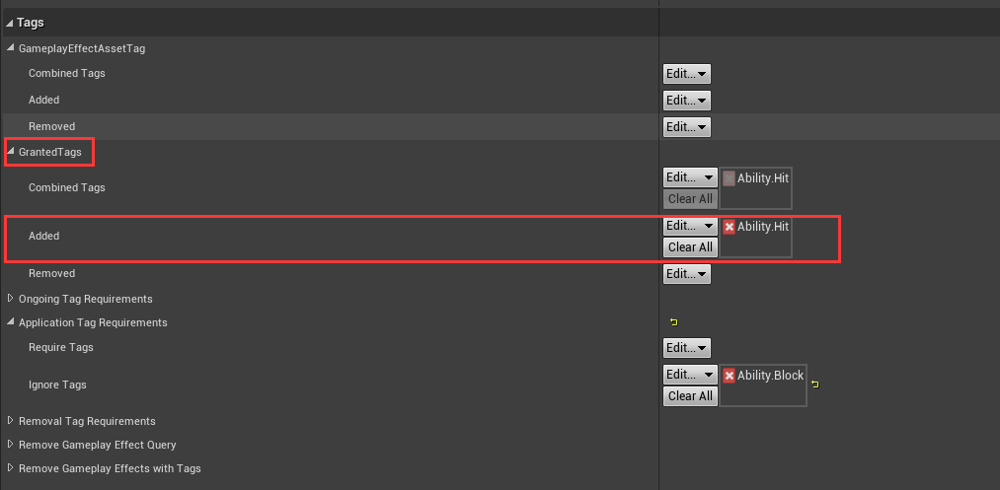

这里给被打的对象添加了一个 `Ability.Hit` 的标签

这个GE会持续 0.1s 的时间, 是因为我们觉得角色被打的僵直动作有 0.1s 

3. 触发 `GA_BeAttack`

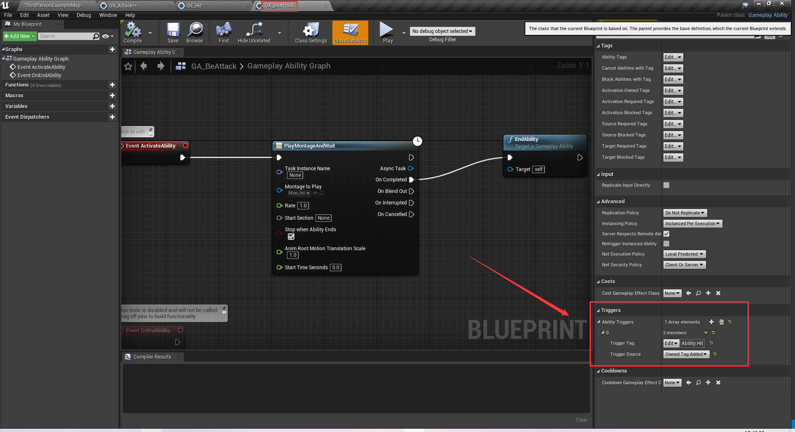

当被打的 `Actor` 添加了 `Ability.Hit` 标签, 那么这个 `GA_BeAttack` 就会被触发

被打的时候就播放一个 `Montage`,

这里被打也是一种能力(某些Boss就是没有被打的能力, 不会出现僵直)

注意这个 `GA_BeAttack` 的 `Triggers` 属性部分, 当 `Ability.Hit` 标签被添加的时候触发

这里 `Trigger Source` 有三种选项

- `Gameplay Event`: 使用 `SendGameplayEvent` 等节点调用, 触发指定 Tag 激活
- `Owned Tag Added`: 当指定 Tag 被添加到 Actor 上时被激活
- `Owned Tag Present`:  // TODO

4. 触发攻击消耗 `GE_Cost`, 配置在 `GA_Attack` 的 Cost 属性中

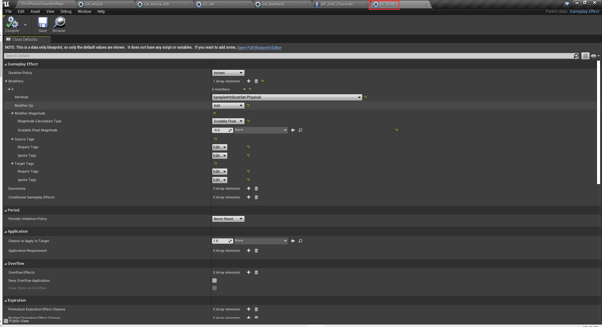

这里可以发现这个 GE 的 `Duration Policy` 是 `Instant` 的, 也就是立即执行的

它配置了一个 `Modifiers`, 这个 `Modifier` 的操作是对 `SampleAttributSet` 的 `Physical` 属性执行 `Add` 操作, 修改的数值是 `-5`, 说白了就是将角色的蓝量扣除5

5. 攻击触发扣血 `GE_Damage`

同理对角色的血量进行扣除

